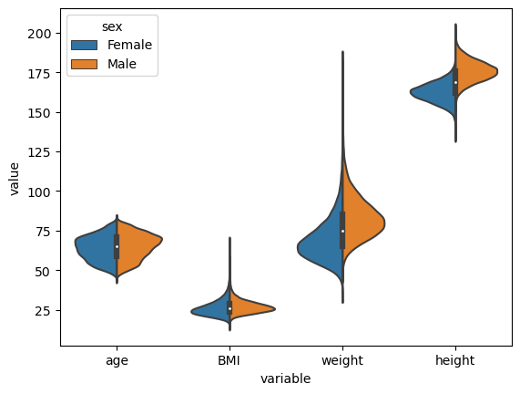

Graph Neural Networks using Medical Digital Twin Data
==============================

Explore performance of Graph Neural Networks on different organs

# Datasets
- A dataset of ~150K organ meshes extracted from MRI scans from the UKBioBank dataset.
Meshes 
- Liver
- Pancreas, 
- Kidneys
- Spleen.
- 30382 Patients.
- Features
-  Sex
-  Age
- BMI, 
- Height
- Weight.
Females: ~51%.
Males: ~49%.

Data statistics can be seen in the following figure


# Setup

To make it easy for you to get started with our model, here's a list of recommended next steps:

- [ ] Clone this repository into a local folder.
```

cd local/path
git clone https://gitlab.lrz.de/waly/digital_twin.git
```
- [ ] Setup the python virtual environement using `conda`.

```
module load python/anaconda3
cd environments 
conda env create -f ./environments/local_digital_twin_env.yaml

```

# Model Architecture


# Hyperparameter search with Wandb Sweeps
Initialize Sweep project from sweep_config.yaml file 
```
wandb sweep --project sweeps_mesh sweeps_config.yaml
```

# Model Training
```
cd src/models
python train.py --model <MODEL> --task <TASK>  --batch_size <Batch Size> --device <GPU_NUMBER> --enc_feats <Enc Feat Dim> --  ...

```
Example:
To train Feastnet on age prediction with default parameters you can apply following command.
```
python train.py --model fsgnet --task age_prediction
```


# Results


- [ ] Check the playground notebooks for usage examples

